# Div Classifications

A guide to distinguishing classifications of the divs on benchmarks.html

## ngs-id

The National Geodetic Survey id number used for their datasheets and as a general reference code.

## mon

The date of monumenting of the benchmark in YYYY-MM-DD format. If the date is a range of years, the most youngest one is used.

## agency

The agency who made the benchmark.

| number | meaning |
|--|--|
| 1 | USGS |
| 2 | USC&GS |
| 3 | NGS |
| 4 | USAFGS |
| 5 | BLM |
| 6 | USACE |
| 7 | GLO |

## rr

The date of the most recent recovery (by me).

## setting

The setting of the benchmark.

| number | meaning | image |
|--|--|--|
| 1 | Round concrete base monument | 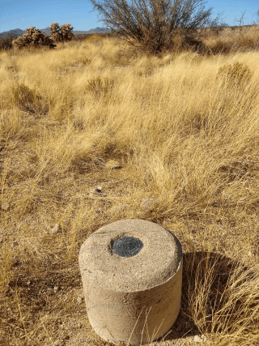 |
| 2 | Squared concrete base monument | 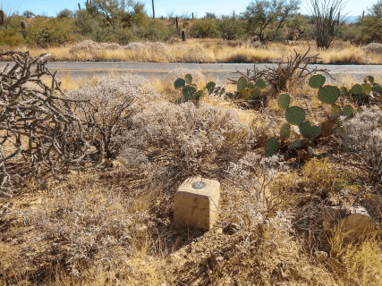 |
| 2 | Other concrete base monument | 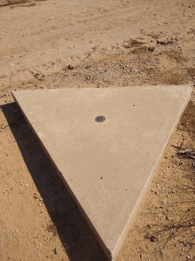 |
| 3 | Prefabricated concrete base monument |  |
| 4 | Rock not firmly in place | 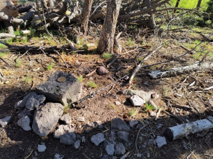 |
| 5 | Firmly in place rock | 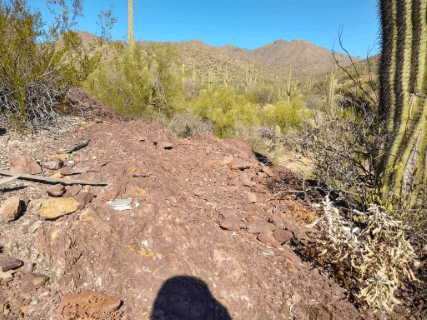 |
| 6 | Street, sidewalk, curb | 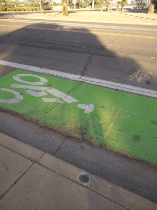 |E8_T26N_R15W.png
| 7 | Footings of small structures |  |
| 8 | Mat foundations |  |
| 9 | Surrounded by mass of concrete |  |
| 10 | Light structures |  |
| 11 | Large structures (other than listed below) |  |
| 12 | Massive structures with deep foundations | 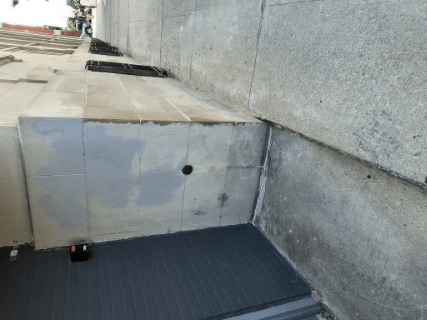 |
| 13 | Massive retaining walls | 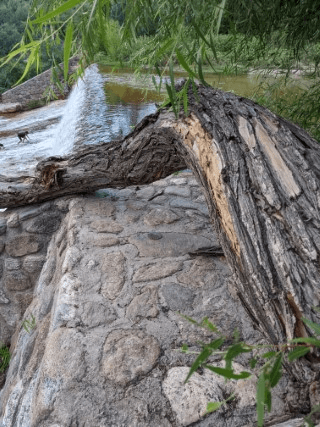 |
| 14 | Abutments of bridge | 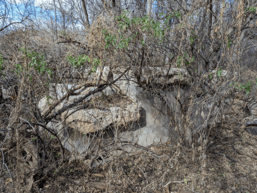 |
| 15 | Tunnels |  |
| 16 | Large structures connected to bedrock |  |
| 17 | Rod driven into ground | 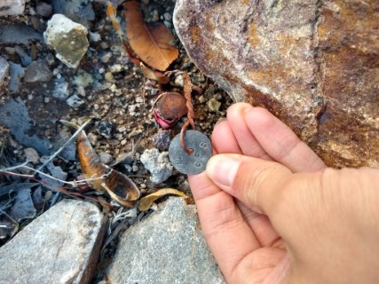 |
| 18 | Rod driven into ground surrounded by concrete or pipe | 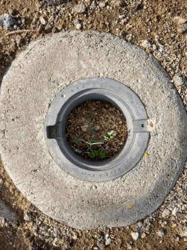 |
| 19 | Atop a metal pipe driven into ground | 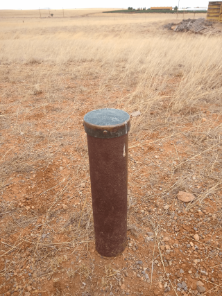 |
| 20 | Driven into ground | 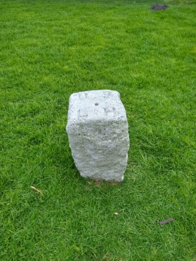 |
| 21 | Atop concrete filled pipe | 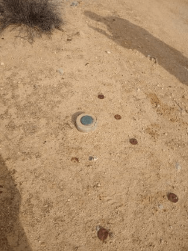 |
| 22 | Other (make a new row) |  |

## con

The condition of the benchmark.

| number | meaning | image |
|--|--|--|
| 1 | Pristine condition with no visible scratches or ware |  |
| 2 | Small amounts of scratches or ware |  |
| 3 | Medium amounts of scratches, gashes, or ware |  |
| 4 | Large amounts of scratches, gashes, or ware, starting to compromise readability|  |
| 5 | Mostly unreadable |  |
| 6 | Majorly deformed or unreadable or 1/4 gone disk |  |
| 7 | 1/2 gone disk or more |  |
| 8 | Stem or pipe still present while the disk is gone | 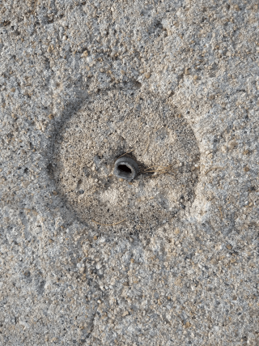 |
| 9 | All disk gone with the setting still present | 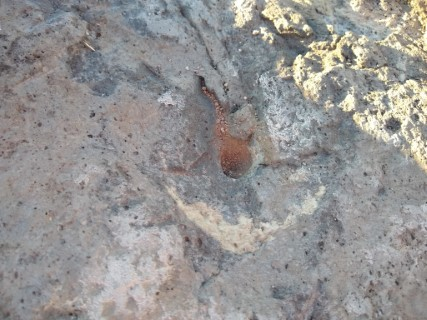 |
| 10 | No remanents | 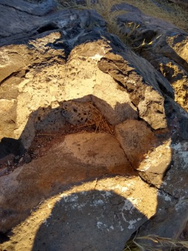 |

## type

WIP - The type/style of the benchmark.

| number | meaning | image |
|--|--|--|
| 2 | USGS "plus" vertical control disk | 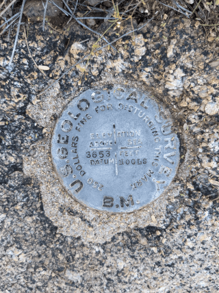 |
| 3 | USGS "plus" vertical control pipe | 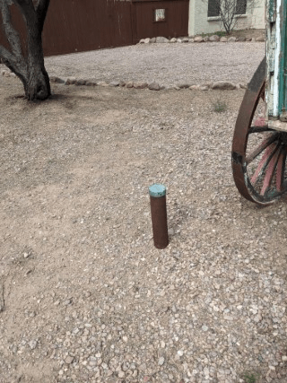 |
| 4 | USGS "plus" vertical control disk with state |  |
| 5 | USGS triangulation no BM 1899-1905 |  |
| 6 | USGS triangulation with BM 1903-1913 | 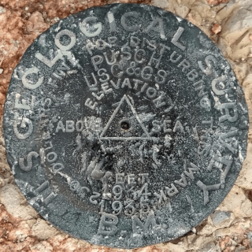 |
| 7 | USGS triangulation with state no BM | https://s3.amazonaws.com/gs-waymarking-images/c91d676b-37ae-4b4c-942a-c80282a7cbfb.jpg |
| 8 | USGS 1907-1932 disk |  |
| 9 | USGS 1907-1932 pipe |  |
| 10 | USGS 1907-1932 in cooperation with the state | https://s3.amazonaws.com/gs-geo-images/2f44184f-bf49-4638-8b1f-674ebba1a314_l.jpg |
| 11 | USGS 1932-1962 no datum | 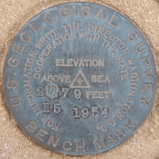 |
| 17 | USGS Triangulation | https://images-sp.summitpost.org/tr:e-sharpen,e-contrast-1,fit-max,q-60,h-800/687944.jpg |
| 12 | USGS DOI 1962- |  |
| 13 | USGS reference old | https://images.fineartamerica.com/images/artworkimages/mediumlarge/3/u-s-geological-survey-reference-mark-7890-patti-deters.jpg |
| 14 | USGS reference new |  |
| 15 | USGS DOI reference | https://images.planetzhanna.com/2003/10/25/ly2774rm2.jpg |
| 74 | USGS Old Gaging Station | https://gs-forums-gc.s3.amazonaws.com/monthly_2021_03/IMG_3965.jpg.d1eca24fb89dab36291ec5c938eb4ac7.jpg |
| 16 | USGS DOI Gaging Station | 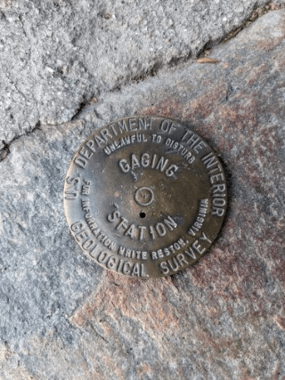 |
| 24 | USGS Meridian Mark | https://www.penryfamily.com/surveying/images/custermeridian4.jpg |
| 21 | USGS washer | http://www.penryfamily.com/surveying/images/usgswasher.jpg |
| 1 | USGS bolt | http://www.penryfamily.com/surveying/images/usgsbolt.jpg |
| 26 | CGS triangulation "superintendent" 1909-1920 |  |
| 27 | CGS triangulation "director" 1920-1972 |  |
| 28 | CGS triangulation convex ~1 cm triangle |  |
| 45 | CGS slash |  |
| 25 | CGS blank cap | https://imgur.com/YFXmUFn |
| 69 | CGS vertical triple cross |  |
| 70 | CGS vertical single cross | 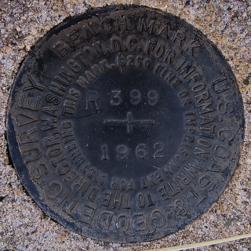 |
| 72 | NGS vertical |  |
| 29 | NGS horizontal control |  |
| 30 | CGS flat 1913-1922 reference | https://s3.amazonaws.com/gs-geo-images/2146e765-bf11-4eca-8e4b-6edff0fce67f.jpg |
| 31 | CGS concave 1919-1972 reference |  |
| 32 | CGS short arrow reference |  |
| 33 | NGS reference |  |
| 34 | CGS azimuth original arrow 1935-1972 | 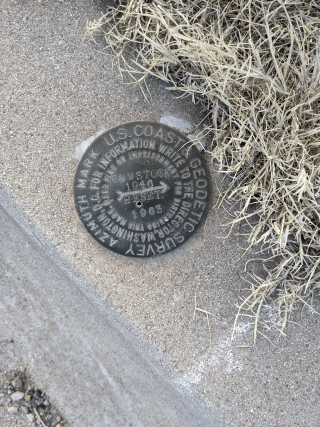 |
| 34 | CGS azimuth large text variant | https://d1u1p2xjjiahg3.cloudfront.net/b38d0a9f-16ec-44ff-9840-81a1ee06a727.jpg |
| 35 | CGS azimuth shorter arrow |  |
| 36 | NGS azimuth | https://www.flickr.com/photos/12262796@N06/2181553906/ |
| 37 | CGS gravity hexagon | https://s3.amazonaws.com/gs-geo-images/532590ce-be71-4a29-9d48-a5497dbeffb6_l.jpg |
| 71 | CGS gravity circle |  |
| 38 | NGS gravity | 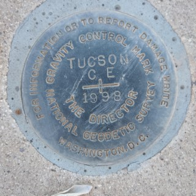 |
| 39 | CGS gravity reference hexagon | https://s3.amazonaws.com/gs-geo-images/adf45150-18fe-4330-8036-f6dbf9d8df7e_l.jpg |
| 75 | CGS gravity reference circle | https://s3.amazonaws.com/gs-geo-images/1ca1c2cd-a909-4434-bb97-dca95cb9013d.jpg |
| 40 | CGS circle benchmark | https://s3.amazonaws.com/gs-geo-images/c07f510e-121f-4013-9c79-21d711987f1d_l.jpg |
| 74 | CGS circle hydrographic station | https://s3.amazonaws.com/gs-geo-images/2651925c-eab3-4e86-b1de-e5bccaf07450.jpg |
| 41 | CGS cup style plus disk (1900-1913) | http://img.geocaching.com/benchmark/lg/c6d6ac9b-59d6-4cec-997a-57bef0bffdff.jpg |
| 42 | CGS cup style triangle disk (1900-1913) | http://img.geocaching.com/benchmark/lg/c6d6ac9b-59d6-4cec-997a-57bef0bffdff.jpg |
| 43 | CGS cup style blank disk (1900-1913) | https://www.ngs.noaa.gov/web/about_ngs/history/Survey_Mark_Art.pdf pg. 9 |
| 44 | CGS WWII Cast Iron Disk | https://s3.amazonaws.com/gs-geo-images/8e864cfd-5f9c-4e03-a235-1b3428fb20c1_l.jpg |
| 46 | CGS topographic | https://d1u1p2xjjiahg3.cloudfront.net/ba718f66-a7c6-4e15-a491-2d53fb89b9d9.jpg |
| 47 | CGS traverse | https://s3.amazonaws.com/gs-geo-images/99bade28-5384-4c82-a77f-0939e649d427.jpg |
| 48 | CGS meridian |  |
| 49 | CGS magnetic | http://www.penryfamily.com/surveying/images/bassettmag2.jpg |
| 50 | CGS state survey |  |
| 51 | USACE |  |
| 52 | USACE war department |  |
| 53 | USACE new | 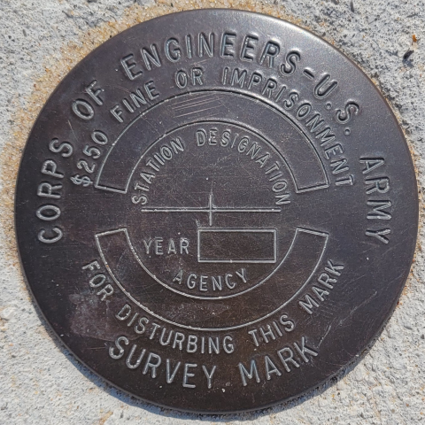 |
| 54 | USCE pipe (this entry could be deleted and replaced with typical pipe) | https://s3.amazonaws.com/gs-waymarking-images/c9f632ed-5b2f-4995-a115-2db8692054e1_l.JPG |
| 55 | air forces geodetic survey marker |  |
| 56 | NOS marker |  |
| 57 | DOI marker (not USGS) |  |
| 58 | DOI marker Bureau of Land Management |  |
| 59 | GLO pipe plus | 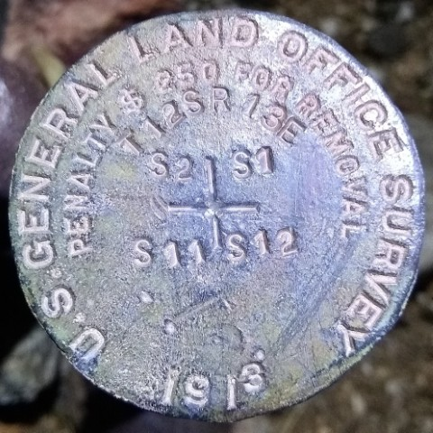 |
| 73 | GLO pipe "T" |  |
| 60 | GLO pipe line | 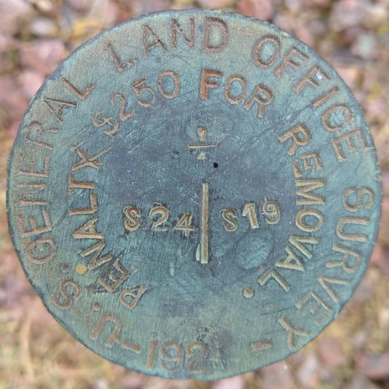 |
| 68 | boundary disk |  |
| 61 | regional survey marker (except triangulation and reference or azimuth) |  |
| 62 | regional survey triangulation |  |
| 63 | regional survey reference |  |
| 64 | regional survey azimuth |  |
| 65 | unmarked rod |  |
| 66 | NGS rod |  |
| 67 | other agency rod |  |
| 18 | marking in rock | 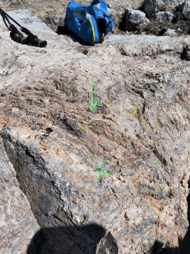 |
| 19 | unmarked bolt |  |
| 20 | unmarked washer |  |
| 22 | stone monument |  |
| 23 | metal monument |  |

## name

The name of the benchmark which is either stamped on it or whatever it is referred to.

## material

The material of the benchmark
